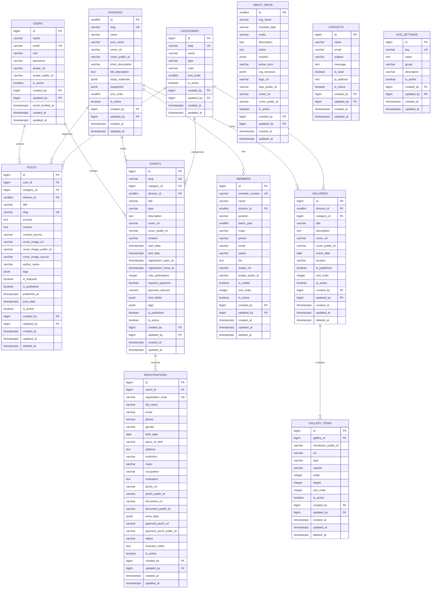

## Entity Relationship Diagram (ERD) — KPA EMC² Web Portal

> **Arsitektur Taksonomi & Relasi Terpadu:**
>
> - **Total 12 Tabel:** Taksonomi `categories` mengklasifikasikan `posts`, `events`, dan `galleries`.
> - **Relasi Divisi Opsional:** `divisions` berelasi opsional (0..*) ke `members`, `posts`, `events`, dan `galleries`.
> - **Audit Log:** Seluruh entitas memiliki 5 kolom audit log (`is_active`, `created_by`, `updated_by`, `created_at`, `updated_at`).
> - **Zero-BLOB:** Seluruh aset media hanya menyimpan `*_url` dan `*_public_id` dari Cloudinary.

