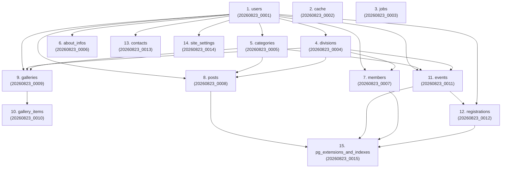

# Migration Architecture & Guide — KPA EMC² Web Portal

> **Target Database:** PostgreSQL 18+ · **Framework:** Laravel 13 · **ORM:** Eloquent

---

## 1. Overview

Sistem migrasi database KPA EMC² dirancang dengan arsitektur **PostgreSQL 18+-first**, **Zero-BLOB Storage**, dan **Audit Trail Standard** untuk seluruh tabel sistem dan 12 tabel aplikasi inti.

### Karakteristik Utama Migrasi:
1. **Urutan Dependensi Ketat (`YYYYMMDD_XXXX`):** Seluruh file migrasi distandarisasi mulai dari `20260823_0001` hingga `20260823_0015` untuk menjamin konsistensi eksekusi Foreign Key.
2. **5 Kolom Audit Log & Indexed FK:** Setiap tabel aplikasi memiliki `is_active`, `created_by`, `updated_by`, `created_at`, dan `updated_at`. Seluruh foreign key audit diindeks untuk performa optimal.
3. **Database-Level JSON Validation:** Kolom `tags` pada `posts` dan `events` divalidasi dengan constraint `CHECK (jsonb_typeof(tags) = 'array')`.
4. **PostgreSQL 18+ Partial Indexes & GIN:** Ekstensi `pg_trgm`, `unaccent`, serta index parsial dan GIN index diaktifkan pada migrasi terdedikasi ([`20260823_0015_create_pg_extensions_and_indexes.php`](file:///home/ali-musthafa-kamal/projects/kpa-emc2-web/database/migrations/20260823_0015_create_pg_extensions_and_indexes.php)).

---

## 2. Dependency Graph & Execution Order



---

## 3. Daftar File Migrasi Lengkap

| # | File Migrasi | Tabel / Aksi | Relasi Foreign Key |
|---|---|---|---|
| 1 | [`20260823_0001_create_users_table.php`](file:///home/ali-musthafa-kamal/projects/kpa-emc2-web/database/migrations/20260823_0001_create_users_table.php) | `users`, `password_reset_tokens`, `sessions` | `created_by`, `updated_by` → `users.id` |
| 2 | [`20260823_0002_create_cache_table.php`](file:///home/ali-musthafa-kamal/projects/kpa-emc2-web/database/migrations/20260823_0002_create_cache_table.php) | `cache`, `cache_locks` | — |
| 3 | [`20260823_0003_create_jobs_table.php`](file:///home/ali-musthafa-kamal/projects/kpa-emc2-web/database/migrations/20260823_0003_create_jobs_table.php) | `jobs`, `job_batches`, `failed_jobs` | — |
| 4 | [`20260823_0004_create_divisions_table.php`](file:///home/ali-musthafa-kamal/projects/kpa-emc2-web/database/migrations/20260823_0004_create_divisions_table.php) | `divisions` | `created_by`, `updated_by` → `users.id` |
| 5 | [`20260823_0005_create_categories_table.php`](file:///home/ali-musthafa-kamal/projects/kpa-emc2-web/database/migrations/20260823_0005_create_categories_table.php) | `categories` | `created_by`, `updated_by` → `users.id` |
| 6 | [`20260823_0006_create_about_infos_table.php`](file:///home/ali-musthafa-kamal/projects/kpa-emc2-web/database/migrations/20260823_0006_create_about_infos_table.php) | `about_infos` | `created_by`, `updated_by` → `users.id` |
| 7 | [`20260823_0007_create_members_table.php`](file:///home/ali-musthafa-kamal/projects/kpa-emc2-web/database/migrations/20260823_0007_create_members_table.php) | `members` | `division_id` → `divisions.id`, `users.id` |
| 8 | [`20260823_0008_create_posts_table.php`](file:///home/ali-musthafa-kamal/projects/kpa-emc2-web/database/migrations/20260823_0008_create_posts_table.php) | `posts` | `user_id`, `category_id`, `division_id` |
| 9 | [`20260823_0009_create_galleries_table.php`](file:///home/ali-musthafa-kamal/projects/kpa-emc2-web/database/migrations/20260823_0009_create_galleries_table.php) | `galleries` | `division_id`, `category_id`, `users.id` |
| 10 | [`20260823_0010_create_gallery_items_table.php`](file:///home/ali-musthafa-kamal/projects/kpa-emc2-web/database/migrations/20260823_0010_create_gallery_items_table.php) | `gallery_items` | `gallery_id` → `galleries.id` (CASCADE) |
| 11 | [`20260823_0011_create_events_table.php`](file:///home/ali-musthafa-kamal/projects/kpa-emc2-web/database/migrations/20260823_0011_create_events_table.php) | `events` | `category_id`, `division_id`, `users.id` |
| 12 | [`20260823_0012_create_registrations_table.php`](file:///home/ali-musthafa-kamal/projects/kpa-emc2-web/database/migrations/20260823_0012_create_registrations_table.php) | `registrations` | `event_id` → `events.id` (CASCADE), `users.id` |
| 13 | [`20260823_0013_create_contacts_table.php`](file:///home/ali-musthafa-kamal/projects/kpa-emc2-web/database/migrations/20260823_0013_create_contacts_table.php) | `contacts` | `created_by`, `updated_by` → `users.id` |
| 14 | [`20260823_0014_create_site_settings_table.php`](file:///home/ali-musthafa-kamal/projects/kpa-emc2-web/database/migrations/20260823_0014_create_site_settings_table.php) | `site_settings` | `created_by`, `updated_by` → `users.id` |
| 15 | [`20260823_0015_create_pg_extensions_and_indexes.php`](file:///home/ali-musthafa-kamal/projects/kpa-emc2-web/database/migrations/20260823_0015_create_pg_extensions_and_indexes.php) | Extensions & Partial Indexes | `pg_trgm`, `unaccent`, GIN, Partial Indexes |

---

## 4. Cara Menjalankan Migrasi

### Menjalankan Seluruh Migrasi:
```bash
php artisan migrate
```

### Menjalankan Ulang Fresh Migrasi (Reset & Re-run):
```bash
php artisan migrate:fresh
```

### Menjalankan Migrasi Beserta Seeder:
```bash
php artisan migrate:fresh --seed
```

### Rollback Batch Terakhir:
```bash
php artisan migrate:rollback
```
