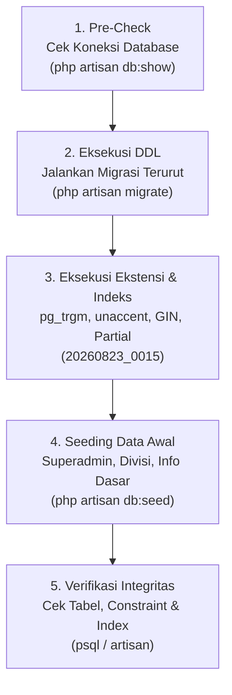

# Panduan & Alur Eksekusi Migrasi Database (Migration Rules & Runbook)

> **Engine:** PostgreSQL 18+ · **Framework:** Laravel 13 · **ORM:** Eloquent

Dokumen ini menjelaskan prosedur baku, alur kerja eksekusi, prasyarat sistem, verifikasi pasca-migrasi, serta aturan evolusi skema untuk proyek **KPA EMC² Web Portal**.

---

## 1. Prasyarat Lingkungan (_Pre-Flight Checklist_)

Sebelum menjalankan perintah migrasi, pastikan komponen berikut telah siap:

### A. Ekstensi PHP PostgreSQL (`pdo_pgsql`)

Laravel membutuhkan driver `pdo_pgsql` untuk berkomunikasi dengan engine PostgreSQL.

- **Ubuntu/Debian:**
  ```bash
  sudo apt-get update && sudo apt-get install -y php-pgsql php8.5-pgsql
  ```
- **Verifikasi Modul Aktif:**
  ```bash
  php -m | grep -i pdo_pgsql
  ```
  _(Output harus menampilkan `pdo_pgsql`)_

### B. Database PostgreSQL 18+ Berjalan

Pastikan server database PostgreSQL telah aktif (via local systemd, Docker, atau Managed Cloud DB seperti Neon/Supabase/AWS RDS):

- **Membuat Database:**
  ```sql
  CREATE DATABASE kpa_emc2_db;
  ```
- **Atau via CLI:**
  ```bash
  createdb -h 127.0.0.1 -p 5432 -U postgres kpa_emc2_db
  ```

### C. Konfigurasi File `.env`

Pastikan kredensial database di `.env` sesuai dengan instance PostgreSQL Anda:

```env
DB_CONNECTION=pgsql
DB_HOST=127.0.0.1
DB_PORT=5432
DB_DATABASE=kpa_emc2_db
DB_USERNAME=postgres
DB_PASSWORD=your_secure_password
```

---

## 2. Alur Eksekusi Migrasi (_Step-by-Step Flow_)



---

## 3. Perintah Eksekusi Migrasi

### A. Eksekusi Pertama Kali (Initial Setup)

Menjalankan seluruh 15 file migrasi secara berurutan:

```bash
php artisan migrate
```

### B. Reset & Migrasi Ulang dari Nol (_Clean State_)

Menghapus seluruh tabel dan membangun ulang struktur database:

```bash
php artisan migrate:fresh
```

### C. Migrasi Fresh Beserta Data Awal (_Recommended for Dev_)

Membangun skema dan langsung mengisi data awal (akun superadmin, data Divisi, singleton about info, pengaturan situs):

```bash
php artisan migrate:fresh --seed
```

### D. Memeriksa Status Migrasi

Melihat tabel mana saja yang sudah atau belum ter-apply:

```bash
php artisan migrate:status
```

---

## 4. Urutan Eksekusi Migrasi (15 File Terurut)

Migrasi dijalankan secara otomatis berdasarkan timestamp `YYYYMMDD_XXXX`:

```
1.  20260823_0001_create_users_table.php             -> users, reset_tokens, sessions
2.  20260823_0002_create_cache_table.php             -> cache, cache_locks
3.  20260823_0003_create_jobs_table.php              -> jobs, job_batches, failed_jobs
4.  20260823_0004_create_divisions_table.php         -> divisions (Divisi)
5.  20260823_0005_create_categories_table.php        -> categories (taksonomi terpadu)
6.  20260823_0006_create_about_infos_table.php       -> about_infos (singleton profil)
7.  20260823_0007_create_members_table.php           -> members (anggota & pengurus)
8.  20260823_0008_create_posts_table.php             -> posts (artikel & constraint tags array)
9.  20260823_0009_create_galleries_table.php         -> galleries (album kegiatan)
10. 20260823_0010_create_gallery_items_table.php     -> gallery_items (item foto/video)
11. 20260823_0011_create_events_table.php            -> events (kegiatan & form dinamis)
12. 20260823_0012_create_registrations_table.php     -> registrations (pendaftaran peserta)
13. 20260823_0013_create_contacts_table.php          -> contacts (pesan kontak masuk)
14. 20260823_0014_create_site_settings_table.php     -> site_settings (konfigurasi global)
15. 20260823_0015_create_pg_extensions_and_indexes.php -> pg_trgm, unaccent, GIN & Partial Indexes
```

---

## 5. Validasi Pasca-Migrasi (_Verification Suite_)

Setelah `php artisan migrate` selesai, lakukan verifikasi integritas melalui database terminal (`psql`):

### A. Memeriksa Daftar Tabel yang Terbentuk (Total 14 Tabel Aplikasi + System)

```sql
\dt
```

### B. Memeriksa Constraint Array JSONB pada `posts` dan `events`

Pastikan database engine menolak data `tags` yang bukan array:

```sql
SELECT conname, pg_get_constraintdef(oid)
FROM pg_constraint
WHERE conname IN ('check_posts_tags_array', 'check_events_tags_array');
```

_Hasil yang diharapkan:_

- `CHECK (jsonb_typeof(tags) = 'array'::text)`

### C. Memeriksa Ekstensi PostgreSQL Aktif

```sql
SELECT extname, extversion FROM pg_extension WHERE extname IN ('pg_trgm', 'unaccent');
```

### D. Memeriksa Indeks GIN & Partial Indexes

```sql
SELECT indexname, indexdef FROM pg_indexes
WHERE indexname LIKE 'idx_%';
```

---

## 6. Prosedur Rollback (_Disaster Recovery_)

Jika terjadi kesalahan atau ingin membatalkan migrasi:

### A. Rollback Batch Terakhir

```bash
php artisan migrate:rollback
```

### B. Rollback Sejumlah Langkah Spesifik

```bash
# Rollback 2 file migrasi terakhir
php artisan migrate:rollback --step=2
```

### C. Reset Total (Menghapus Seluruh Tabel yang Dibuat Migrasi)

```bash
php artisan migrate:reset
```

---

## 7. Aturan Baku Evolusi Skema di Masa Depan (_Migration Rules_)

Untuk menjaga integritas data dan kestabilan sistem production:

1. **DILARANG Mengubah File Migrasi yang Sudah Dirilis:**
   - File migrasi yang sudah pernah dijalankan di server production **tidak boleh diedit**.
   - Setiap perubahan skema (tambah kolom, ubah tipe data, tambah index) **wajib membuat file migrasi baru** via:
     ```bash
     php artisan make:migration add_new_column_to_table_name --table=table_name
     ```

2. **Format Penamaan File Migrasi Baru:**
   - Gunakan format timestamp standar: `YYYYMMDD_XXXX_action_table_name.php` (misal: `20260901_0001_add_status_notes_to_registrations_table.php`).

3. **Standar Kolom Baru:**
   - Gunakan tipe `TIMESTAMPTZ` untuk waktu.
   - Gunakan tipe `JSONB` untuk data semi-terstruktur.
   - Kolom ForeignKey **wajib** menyertakan index: `$table->foreignId('...')->nullable()->index()->constrained('...')->nullOnDelete();`.
   - Asset media **wajib** mematuhi _Zero-BLOB policy_ (hanya simpan `*_url` dan `*_public_id` Cloudinary).

4. **Zero-Downtime Rule untuk Tabel Besar:**
   - Saat menambahkan indeks pada tabel production yang aktif, gunakan non-blocking index:
     ```sql
     CREATE INDEX CONCURRENTLY ...
     ```
